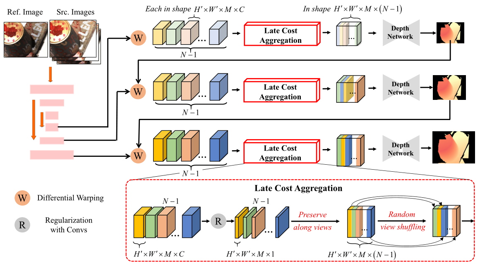

# LAMVSNet
The official code repository for the paper:
> **Boosting Multi-view Stereo with Late Cost Aggregation**
>
> Jiang Wu, Rui Li, Yu Zhu, Jinqiu Sun and Yanning Zhang
> **[[arXiv]()]**

**[TL; DR]** We present a simple channel-wise MVS cost aggregation that achieves competitive performances to SOTAs with only minor adjustments to the CasMVSNet.
 
## Introduction
Pairwise matching cost aggregation is a crucial step for modern learning-based Multi-view Stereo (MVS). Prior works adopt an early aggregation scheme, which adds up pairwise costs into an intermediate cost. However, we analyze that this process can degrade informative pairwise matchings, thereby blocking the depth network from fully utilizing the original geometric matching cues. To address this challenge, we present a late aggregation approach that allows for aggregating pairwise costs throughout the network feed-forward process, achieving accurate estimations with only minor changes of the plain CasMVSNet. Instead of building an intermediate cost by weighted sum, late aggregation preserves all pairwise costs along a distinct view channel. This enables the succeeding depth network to fully utilize the crucial geometric cues without loss of cost fidelity. Grounded in the new aggregation scheme, we propose further techniques addressing view order dependence inside the preserved cost, handling flexible testing views, and improving the depth filtering process. Despite its technical simplicity, our method improves significantly upon the baseline cascade-based approach, achieving comparable results with state-of-the-art methods with favorable computation overhead.



##  Environment Setup
```
# create a clean conda environment from scratch
conda create -n MVS python=3.8
conda activate MVS
# install required packages
pip install -r requirements.txt
```
##  Dataset
#### 1. DTU Dataset  
  
Download preprocessed  [DTU training data](https://drive.google.com/file/d/1eDjh-_bxKKnEuz5h-HXS7EDJn59clx6V/view)  and [Depth raw](https://virutalbuy-public.oss-cn-hangzhou.aliyuncs.com/share/cascade-stereo/CasMVSNet/dtu_data/dtu_train_hr/Depths_raw.zip) for training, and  [DTU testing data](https://drive.google.com/file/d/135oKPefcPTsdtLRzoDAQtPpHuoIrpRI_/view) for testing. Organize the data like below:  
```
dtu_training                            
       ├── Cameras                  
       ├── Depths                  
       ├── Depths_raw                     
       └── Rectified
dtu_testing                            
       ├── Cameras                  
       ├── scan1                   
       ├── scan2               
       ├── .. 
 ```
  
#### 2. BlendedMVS Dataset  
  
Download the preprocessed [BlendedMVS](https://drive.google.com/file/d/1ilxls-VJNvJnB7IaFj7P0ehMPr7ikRCb/view) and unzip it to as the dataset folder like below:
```
blendedmvs                            
       ├── 5a0271884e62597cdee0d0eb                  
       ├── 5a3ca9cb270f0e3f14d0eddb                    
       ├── ...                                                              
	   ├── all_list.txt                                                  
  	   ├── training_list.txt                                          
       ├── ...                                                              
 ```
  
#### 3. Tanks and Temples Dataset  
  
You can download the [Tanks and Temples](https://drive.google.com/file/d/1YArOJaX9WVLJh4757uE8AEREYkgszrCo/view) here and unzip it. 
For the intermediate set, unzip "short_range_caemeras_for_mvsnet.zip" and replace the camera parameter files inside the "cam" folder with them.
```
tanksandtemples                            
       ├── advanced                   
       │   ├── Auditorium         
       │   ├── ...    
       └── intermediate  
           ├── Family
           ├── ... 
 ```
  
## Training
#### 1. Training on DTU dataset

Replace the path of the DTU training dataset in the "datapath" and then run the script:

```
bash ./script/dtu_train.sh
 ```

#### 2. Fine-tuning on BlendedMVS dataset 
  
Specify the path for the BlendMVS dataset and the save path for the DTU training model, then proceed to run the script.
```
bash ./scripts/blendedmvs_finetune.sh
```
You can also download our pre-trained and fine-tuned models.

（1）Training on DTU dataset： [dtu.ckpt](https://drive.google.com/file/d/13OrM29W3ntZQIjenDUNP1hkco7EDQ3re/view?usp=drive_link)

（2）Fine-tuning on BlendedMVS dataset: [bld.ckpt](https://drive.google.com/file/d/1wz7wZid82cKsb1Vwy3sDFut6vVVa8CIy/view?usp=drive_link)
## Point cloud testing
#### 1. Generate point cloud on DTU dataset

Specify the "datapath" and execute the testing script:
  ```
bash ./script/dtu_test.sh
 ```
 Note that the point cloud fusion strategy we employed is the improved dynamic filtering strategy. For more details, please refer to the paper.
#### 2. Generate point cloud on TNT dataset
  ```
bash ./scripts/tank_test.sh 
 ```
 The point cloud filtering parameters for each scene are stored in ./filter/tank_test_config.py. Fine-tuning these parameters might lead to improved results.
## Acknowledgements  
 Our code is based on [UniMVSNet](https://github.com/prstrive/UniMVSNet) and [DH2C-MVSNet](https://github.com/yhw-yhw/D2HC-RMVSNet). We express gratitude for these works.

